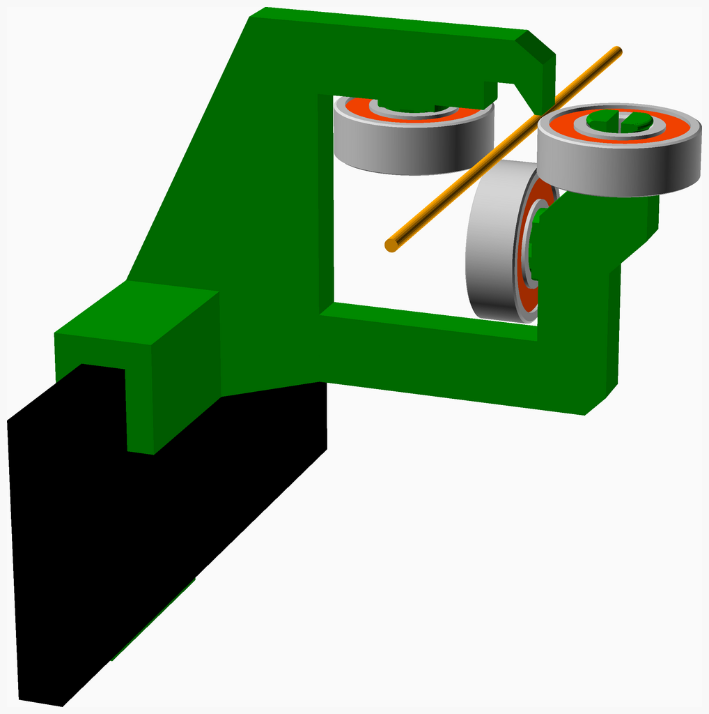
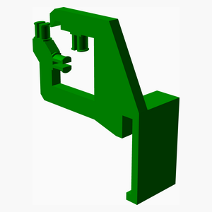
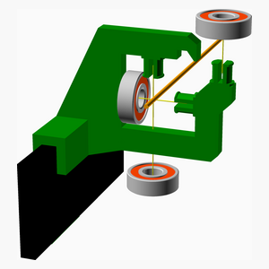
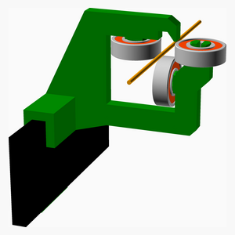

# MK3FilamentGuide

---
## Table of Contents
1. [Parts list](#Parts_list)
1. [Main Assembly](#main_assembly)

[Top](#TOP)

---

## Parts list
| Main | TOTALS |  |
|---:|---:|:---|
|  | | **Vitamins** |
| &nbsp;&nbsp;3&nbsp; |  &nbsp;&nbsp;3&nbsp; | &nbsp;&nbsp; Ball bearing 608-2RS 8mm x 22mm x 7mm |
| &nbsp;&nbsp;3&nbsp; | &nbsp;&nbsp;3&nbsp; | &nbsp;&nbsp;Total vitamins count |
|  | | **3D printed parts** |
| &nbsp;&nbsp;1&nbsp; |  &nbsp;&nbsp;1&nbsp; | &nbsp;&nbsp;MK3FilamentGuide.stl |
| &nbsp;&nbsp;1&nbsp; | &nbsp;&nbsp;1&nbsp; | &nbsp;&nbsp;Total 3D printed parts count |

[Top](#TOP)

---

## Main Assembly
### Vitamins
|Qty|Description|
|---:|:----------|
|3| Ball bearing 608-2RS 8mm x 22mm x 7mm|

### 3D Printed parts

| 1 x MK3FilamentGuide.stl |
|---|
|  

### Assembly instructions

Push three ball bearings onto the printed part. 

[Top](#TOP)
